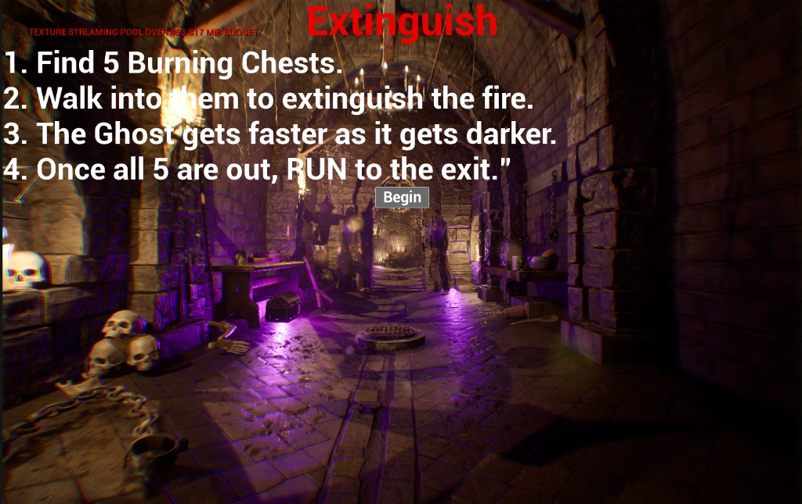
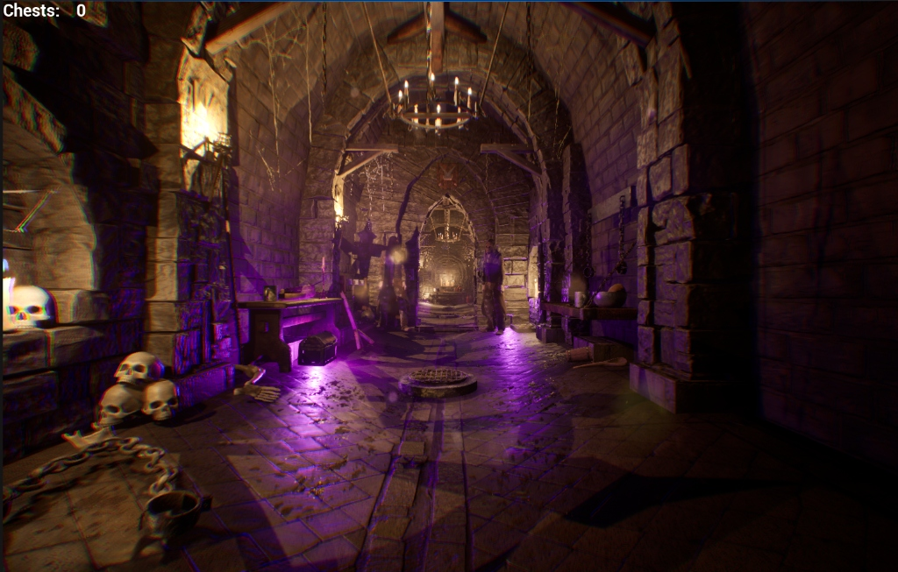
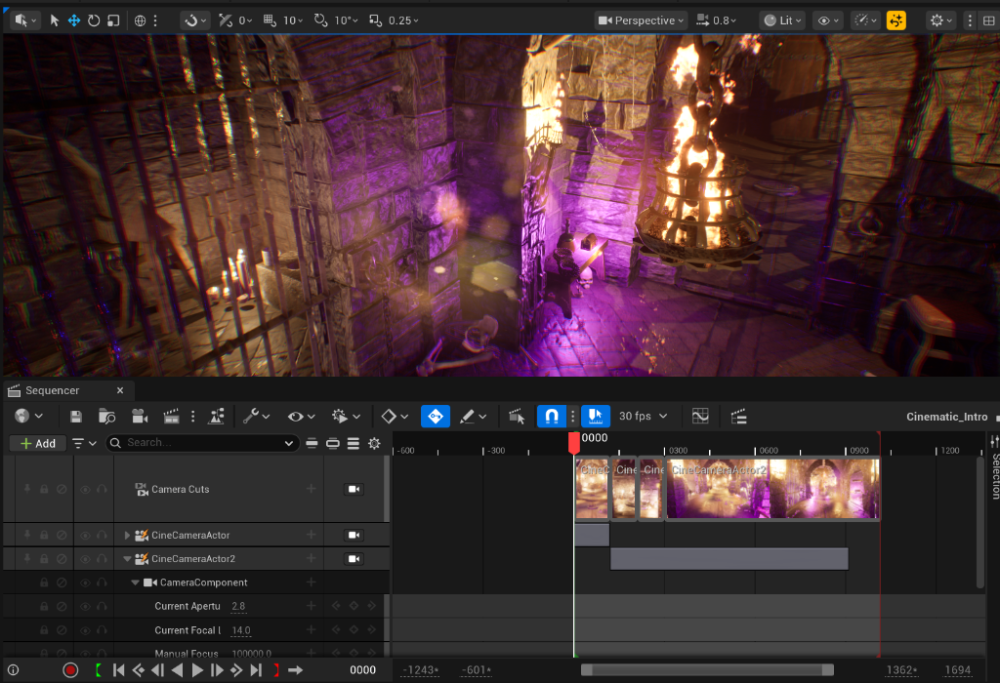

# Extinguish - UE5 Prototype

## Description
**Extinguish** is a dark, atmospheric dungeon exploration game developed in Unreal Engine 5. The player finds themselves trapped in a dimly lit, medieval dungeon haunted by a ghost.

**Goal:** Survive and escape.

## Gameplay Mechanics
The core loop involves exploration and survival:
1. **Find 5 Burning Chests**: Locate the chests scattered throughout the dungeon.
2. **Extinguish the Fire**: Walk into the chests to put out the flames.
3. **Dynamic Difficulty**: The Ghost gets faster as the environment gets darker.
4. **Escape**: Once all 5 fires are extinguished, RUN to the exit.

## Screenshots
### Instructions & Objective


### Atmospheric Gameplay


### Cinematic & Sequencer


## Getting Started
To run this project, you will need:
- Unreal Engine 5 (check `.uproject` for specific version)
- Visual Studio (for C++ compilation if required)

## Installation
1. Clone the repository:
   ```bash
   git clone https://github.com/HARSH-1607/Extinguish_UE5_Prototype.git
   ```
2. Open `Extinguish.uproject`.
3. If prompted, rebuild the project modules.
